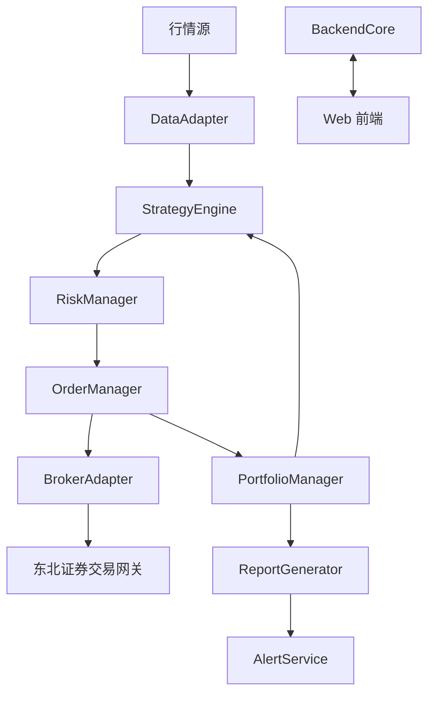

# Architecture Design - A股量化监控与交易系统

## 1. 文件与文件夹结构

```
quant-trading-system/
├── backend/
│   ├── core/                # 系统核心逻辑（事件循环、消息队列、调度）
│   │   ├── event_loop.h/.cpp
│   │   ├── message_bus.h/.cpp
│   │   ├── config_manager.h/.cpp
│   │   └── utils/
│   │       ├── logger.h/.cpp
│   │       ├── timer.h/.cpp
│   │       └── file_io.h/.cpp
│   │
│   ├── data/                # 数据层（实时行情、历史回测、数据缓存）
│   │   ├── data_adapter.h/.cpp
│   │   ├── market_data_feed.h/.cpp
│   │   ├── csv_loader.h/.cpp
│   │   └── storage/         # 本地缓存
│   │       └── *.csv
│   │
│   ├── strategy/            # 策略引擎
│   │   ├── strategy_base.h/.cpp
│   │   ├── ma_rsi_strategy.h/.cpp
│   │   ├── breakout_atr_strategy.h/.cpp
│   │   └── vwap_strategy.h/.cpp
│   │
│   ├── execution/           # 执行引擎（交易适配器）
│   │   ├── broker_adapter.h/.cpp
│   │   ├── dongbei_sec_adapter.h/.cpp
│   │   └── order_manager.h/.cpp
│   │
│   ├── risk/                # 风控模块
│   │   ├── risk_manager.h/.cpp
│   │   └── position_validator.h/.cpp
│   │
│   ├── portfolio/           # 资金与持仓管理
│   │   ├── portfolio_manager.h/.cpp
│   │   └── allocator.h/.cpp
│   │
│   ├── reporting/           # 日志与报表
│   │   ├── report_generator.h/.cpp
│   │   ├── trade_log.h/.cpp
│   │   └── alert_service.h/.cpp
│   │
│   └── main.cpp             # 程序入口
│
├── frontend/                # Web 前端
│   ├── public/
│   ├── src/
│   │   ├── components/      # UI 组件
│   │   ├── pages/           # 页面
│   │   ├── services/        # 与后端 WebSocket/REST 交互
│   │   └── App.jsx
│   └── package.json
│
├── config/                  # 配置文件
│   ├── default.yaml
│   ├── strategies.yaml
│   └── risk.yaml
│
├── tests/                   # 单元测试与回测验证
│   ├── test_strategy.cpp
│   ├── test_risk.cpp
│   └── test_execution.cpp
│
├── docs/                    # 文档
│   └── architecture.md
│
└── CMakeLists.txt           # 构建配置
```

---

## 2. 模块说明

### 2.1 backend/core
- **event_loop**：负责系统事件驱动与调度，统一时钟源。  
- **message_bus**：模块间异步通信（行情、交易、策略信号）。  
- **config_manager**：加载与热更新配置。  
- **utils**：日志、计时器、文件工具。  

### 2.2 backend/data
- **data_adapter**：统一接口，支持实盘与回测。  
- **market_data_feed**：实时行情订阅。  
- **csv_loader**：历史数据读取（Tick/Bar CSV）。  
- **storage**：缓存目录。  

### 2.3 backend/strategy
- **strategy_base**：抽象类，定义输入（行情、持仓）、输出（信号）。  
- **具体策略**：如 MA+RSI、突破+ATR、VWAP 策略。  

### 2.4 backend/execution
- **broker_adapter**：交易适配层抽象。  
- **dongbei_sec_adapter**：东北证券直连实现。  
- **order_manager**：统一下单、撤单、成交回报处理。  

### 2.5 backend/risk
- **risk_manager**：检查风控规则（回撤、ST、涨跌停等）。  
- **position_validator**：仓位与资金合法性校验。  

### 2.6 backend/portfolio
- **portfolio_manager**：跟踪持仓、资金变化。  
- **allocator**：资金分配算法（波动率目标）。  

### 2.7 backend/reporting
- **report_generator**：生成日报、对账单。  
- **trade_log**：结构化日志。  
- **alert_service**：桌面弹窗、声音、邮件。  

### 2.8 frontend
- React + WebSocket 实时渲染行情、持仓与信号。  
- 深色主题，简洁 UI。  

### 2.9 config
- **default.yaml**：系统通用配置。  
- **strategies.yaml**：策略参数。  
- **risk.yaml**：风控阈值。  

---

## 3. 状态储存位置

- **内存态**：
  - 实时行情（内存环形缓冲区）。  
  - 策略信号（消息队列）。  
  - 持仓/资金（PortfolioManager 内存对象）。  

- **持久化**：
  - 日志（JSONL / CSV）。  
  - 报表（CSV / HTML）。  
  - 回测历史数据（CSV 文件）。  

---

## 4. 服务之间的连接



- **行情流**：行情源 → DataAdapter → 策略。  
- **交易流**：策略 → 风控 → 执行引擎 → 券商。  
- **状态流**：成交回报 → OrderManager → PortfolioManager。  
- **可视化**：BackendCore → WebSocket → 前端。  
